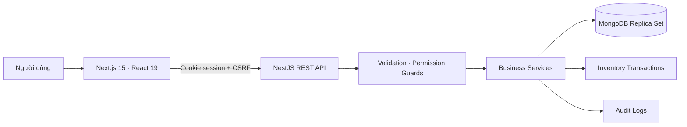
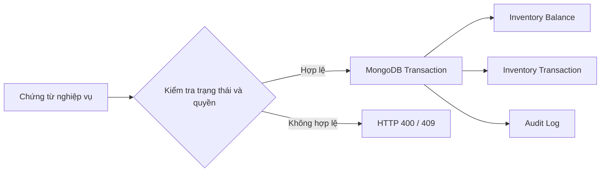

<div align="center">

# PMQLTB

### Hệ thống quản lý thiết bị, linh kiện và vòng đời tài sản dành cho phòng IT

[](https://nextjs.org/)
[](https://react.dev/)
[](https://nestjs.com/)
[](https://www.mongodb.com/)
[](https://www.typescriptlang.org/)

Một nền tảng thống nhất để quản lý tài sản IT từ lúc nhập kho, cấp phát và sử dụng đến kiểm kê, sửa chữa, thu hồi và thanh lý.

</div>

---

## Tổng quan

PMQLTB giúp phòng IT theo dõi chính xác thiết bị và linh kiện tại từng kho, bộ phận và người giữ. Hệ thống dùng chứng từ và giao dịch kho làm nguồn dữ liệu nghiệp vụ, có phân quyền chi tiết, nhật ký audit và các state machine bảo vệ luồng xử lý.

Giao diện hỗ trợ desktop, tablet và mobile; API có tài liệu Swagger; MongoDB chạy ở chế độ replica set để hỗ trợ transaction ngay trong môi trường phát triển.

## Chức năng chính

| Nhóm                   | Chức năng                                                                               |
| ---------------------- | --------------------------------------------------------------------------------------- |
| **Tổng quan**          | KPI tài sản, phân bổ thiết bị, cảnh báo, xu hướng nhập/xuất và hoạt động gần đây        |
| **Thiết bị**           | Hồ sơ tài sản, asset code, serial, model, tình trạng, vị trí, người giữ và tệp đính kèm |
| **Linh kiện**          | Quản lý theo số lượng hoặc từng serial, tồn tối thiểu, loại và model linh kiện độc lập  |
| **Kho**                | Chọn kho tại chỗ, xem thiết bị thực tế trong kho, tồn linh kiện và lịch sử giao dịch    |
| **Nhập kho**           | Lập, hoàn tất và đảo phiếu nhập; cập nhật số dư bằng transaction                        |
| **Cấp phát**           | Giao thiết bị/linh kiện cho nhân sự hoặc bộ phận                                        |
| **Mượn / trả**         | Theo dõi hạn trả, trả từng phần, tình trạng nhận lại và lịch sử trả                     |
| **Điều chuyển**        | Điều chuyển giữa các kho với bước xuất, tiếp nhận và từ chối                            |
| **Thu hồi**            | Thu hồi tài sản đã cấp phát về kho và ghi nhận tình trạng thực tế                       |
| **Sửa chữa**           | Tiếp nhận, đang sửa, hoàn tất, không thể sửa và hướng xử lý sau sửa                     |
| **Kiểm kê**            | Snapshot số liệu, ghi nhận thực tế, phát hiện và xử lý chênh lệch                       |
| **Thanh lý**           | Lập phiếu, gửi duyệt, phê duyệt/từ chối và hoàn tất thanh lý                            |
| **Báo cáo**            | Báo cáo tài sản, tồn kho, giao dịch và xuất Excel                                       |
| **Nhân sự & danh mục** | Bộ phận, chức vụ, người giữ, kho, vị trí, nhà cung cấp, loại/model và đơn vị tính       |
| **Quản trị**           | Tài khoản, khóa/mở khóa, vai trò, permission, đặt lại mật khẩu và audit log             |
| **Thông báo**          | Chuông thông báo theo tài khoản, badge chưa đọc, đánh dấu đọc và trang tổng hợp         |

## Kiến trúc



```text
PMQuanLyThietBi/
├── apps/
│   ├── api/                 # NestJS API, schema, service và test
│   └── web/                 # Next.js App Router UI
├── docker/
│   ├── mongodb.yml          # MongoDB 7 replica set cho local development
│   └── init-replica-set.sh
├── .env.example
├── package.json             # npm workspaces
└── README.md
```

## Công nghệ

| Tầng     | Công nghệ                                                                         |
| -------- | --------------------------------------------------------------------------------- |
| Frontend | Next.js 15, React 19, TypeScript, Tailwind CSS, Radix Slot, Lucide Icons, SheetJS |
| Backend  | NestJS 10, Mongoose 8, Swagger, class-validator, Jest                             |
| Database | MongoDB 7 replica set, transaction, optimistic concurrency, unique index          |
| Security | HttpOnly session cookie, CSRF, CORS allowlist, permission guards, scrypt          |
| Tooling  | npm workspaces, ESLint, Prettier, Docker Compose                                  |

## Cài đặt và chạy local

Yêu cầu Node.js **20 trở lên**, npm, Git và Docker Desktop.

```bash
git clone git@github.com:HoangPhiHungGG/phan_mem_quan_ly_thiet_bi.git
cd phan_mem_quan_ly_thiet_bi
npm install
cp .env.example .env
npm run db:up
npm run bootstrap:admin --workspace=@pmqltb/api
npm run dev
```

| Dịch vụ            | Địa chỉ                                  |
| ------------------ | ---------------------------------------- |
| Web                | <http://localhost:3000>                  |
| API                | <http://localhost:3001>                  |
| API Health         | <http://localhost:3001/api/health>       |
| Database Readiness | <http://localhost:3001/api/health/ready> |
| Swagger UI         | <http://localhost:3001/api/docs>         |

### Cấu hình môi trường

```env
PORT=3001
MONGODB_URI=mongodb://127.0.0.1:27017/pmqltb?replicaSet=rs0&directConnection=true
CORS_ORIGINS=http://localhost:3000
SESSION_TTL_HOURS=8
NEXT_PUBLIC_API_URL=http://localhost:3001
```

Không commit `.env`, mật khẩu hoặc URI chứa credential. MongoDB local dùng replica set một node để transaction hoạt động; `npm run db:stop` dừng container nhưng giữ nguyên volume dữ liệu.

## Tạo quản trị viên đầu tiên

Các giá trị được đọc từ biến môi trường và không hard-code trong source:

```bash
export BOOTSTRAP_ADMIN_EMAIL="admin@example.com"
export BOOTSTRAP_ADMIN_DISPLAY_NAME="Quản trị viên"
export BOOTSTRAP_ADMIN_EMPLOYEE_CODE="ADMIN001"
read -s BOOTSTRAP_ADMIN_PASSWORD
export BOOTSTRAP_ADMIN_PASSWORD
npm run bootstrap:admin --workspace=@pmqltb/api
unset BOOTSTRAP_ADMIN_PASSWORD
```

Bootstrap có khóa one-time và từ chối chạy nếu hệ thống đã có tài khoản.

## Bảo mật

- Token phiên ngẫu nhiên nằm trong cookie `HttpOnly`; database chỉ lưu hash SHA-256.
- Cookie dùng `SameSite=Lax` và tự bật `Secure` trong production.
- Request thay đổi dữ liệu phải vượt qua kiểm tra CSRF và origin.
- API whitelist DTO và từ chối field không khai báo.
- Backend kiểm tra quyền ở từng chức năng, độc lập với việc ẩn nút trên UI.
- Khóa tài khoản hoặc thay đổi quyền sẽ thu hồi các phiên liên quan.
- Mật khẩu được băm bằng `scrypt` với salt ngẫu nhiên.
- Đăng nhập sai được giới hạn theo cặp IP và email.

## Tính nhất quán nghiệp vụ



- Snapshot kiểm kê giữ nguyên số liệu tại thời điểm bắt đầu.
- Chênh lệch kiểm kê không tự sửa dữ liệu gốc khi chưa được xử lý.
- Thiết bị chỉ được tính là trong kho khi có trạng thái `IN_STOCK` và không có người giữ.
- Linh kiện theo serial yêu cầu số lượng khớp với số serial hợp lệ.
- Model thiết bị và model linh kiện được phân tách bằng `entityType`.
- Các thao tác quan trọng dùng transaction hoặc optimistic concurrency.

## Kiểm thử và chất lượng

```bash
npm run lint
npm run typecheck
npm run test
npm run build

# E2E API với MongoDB local đang chạy
npm run test:e2e
```

Các integration test có transaction cần MongoDB replica set hoạt động. Chạy `npm run db:up` trước khi chạy.

## Lệnh thường dùng

| Lệnh                | Mục đích                         |
| ------------------- | -------------------------------- |
| `npm run dev`       | Chạy đồng thời API và Web        |
| `npm run dev:api`   | Chỉ chạy NestJS API              |
| `npm run dev:web`   | Chỉ chạy Next.js Web             |
| `npm run build`     | Build toàn bộ workspace          |
| `npm run lint`      | Kiểm tra ESLint                  |
| `npm run typecheck` | Kiểm tra TypeScript              |
| `npm run test`      | Chạy test hiện có                |
| `npm run test:e2e`  | Chạy E2E API                     |
| `npm run db:up`     | Khởi động MongoDB và replica set |
| `npm run db:stop`   | Dừng MongoDB, giữ dữ liệu        |
| `npm run db:logs`   | Xem log MongoDB                  |

## Khôi phục mật khẩu quản trị ở local

```bash
export RESET_PASSWORD_EMAIL="admin@example.com"
read -s RESET_PASSWORD_NEW_PASSWORD
export RESET_PASSWORD_NEW_PASSWORD
npm run reset-password:local --workspace=@pmqltb/api
unset RESET_PASSWORD_NEW_PASSWORD
```

Lệnh không in mật khẩu, cập nhật password hash và thu hồi phiên cũ của tài khoản.

## Nguyên tắc dữ liệu

- Không reset hoặc xóa MongoDB để sửa lỗi nghiệp vụ.
- Không bypass transaction/audit khi điều chỉnh tồn kho.
- Không dùng AuditLog thay cho Notification.
- Không lưu token hoặc mật khẩu trong source, README hay lịch sử Git.
- Mã tài sản, serial và mã phiếu là định danh nghiệp vụ; mã danh mục phụ có thể được backend tự sinh.

---

<div align="center">

**PMQLTB · Quản lý tài sản IT rõ ràng, có kiểm soát và truy vết được**

</div>
